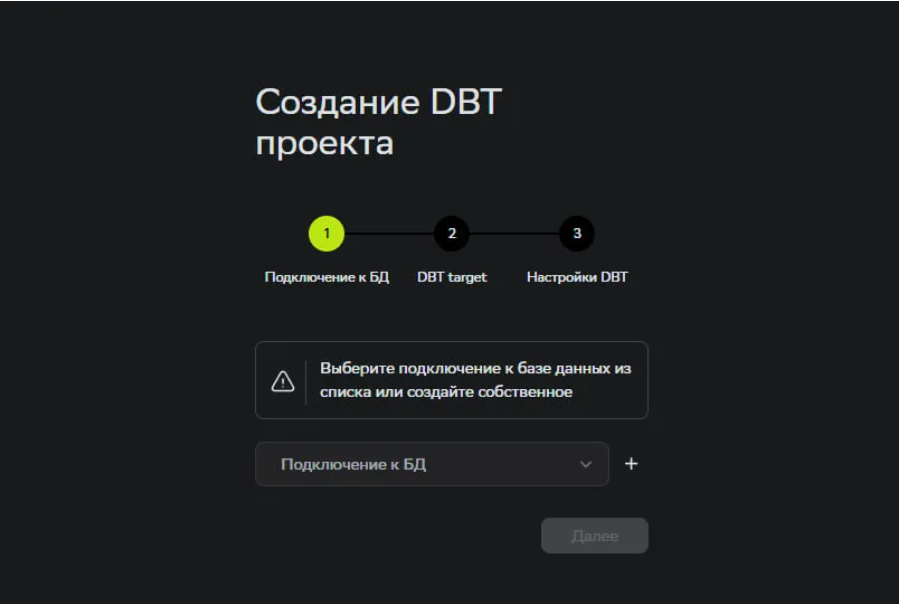
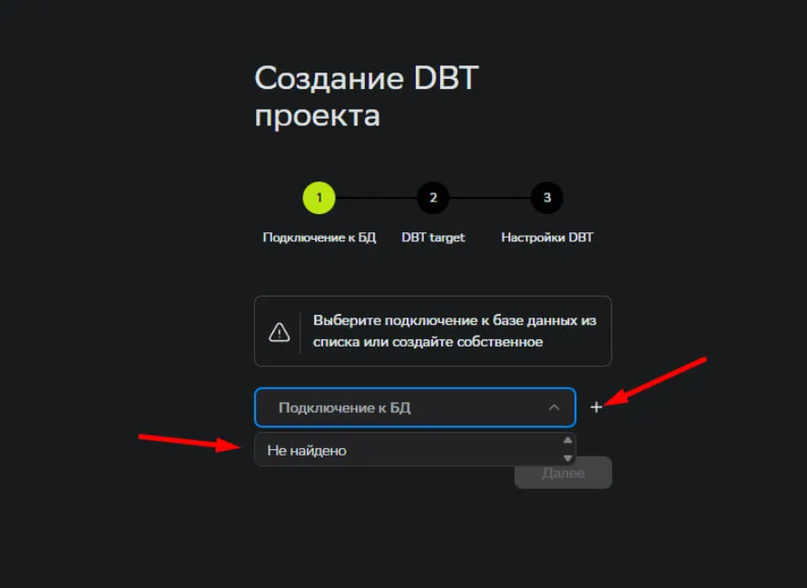
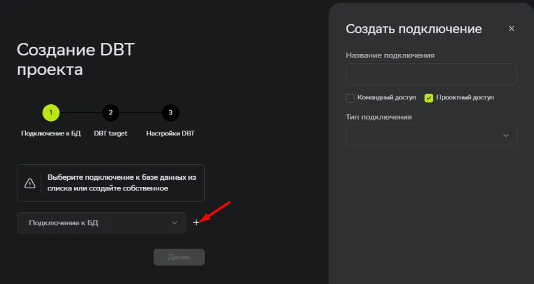
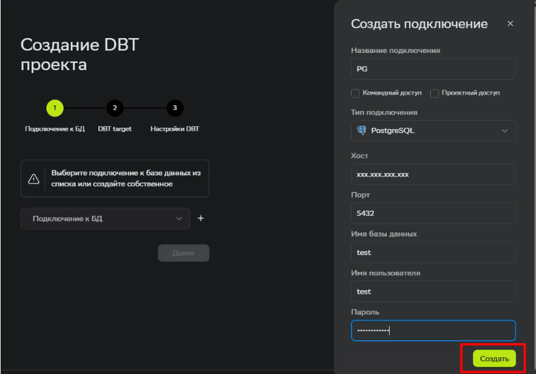
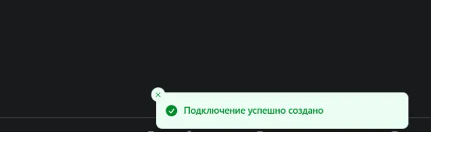
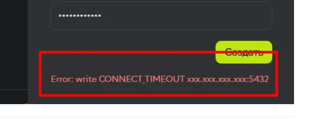

## Подключение к базе данных

При создании проекта dbt необходимо настроить подключение к базе данных. Это нужно для выполнения моделей, запросов и работы с данными.

### Выбор подключения

- Все доступные подключения отображаются в выпадающем списке

- Если подключений нет, нажмите «+» справа от списка, чтобы создать новое

### Создание нового подключения

При создании подключения необходимо заполнить следующие параметры:

- **Название подключения** Удобное имя для подключения. Используется только внутри сервиса (например: `prod_postgres`).
- **Выбрать доступ** Определяет, кто может использовать подключение. Командный доступ: доступно всей команде, проектный доступ: только в рамках проекта.
- **Тип подключения** Выберите источник данных: база данных или хранилище (например: PostgreSQL, ClickHouse, S3).

**Для баз данных**

- **Хост (Host)** Адрес сервера. Убедитесь, что база доступна извне и разрешён доступ по IP.
- **Порт (Port)** Порт для подключения к базе данных (например: 5432 для PostgreSQL, 8123 для ClickHouse).
- **Имя базы данных** Название базы данных, к которой выполняется подключение.
- **Имя пользователя (User)** Логин для доступа к базе данных.
- **Пароль (Password)** Пароль пользователя базы данных.

**Для S3 и совместимых хранилищ**

- **Эндпоинт (Endpoint)** Адрес S3-совместимого хранилища
- **Access Key** Публичный ключ доступа к хранилищу.
- **Secret Key** Секретный ключ доступа. Храните его в безопасности.
- **Регион** Регион хранилища (например: ru-central-1).
- **Бакет S3** Название бакета, в котором хранятся данные.
- **Путь (необязательно)** Папка внутри бакета. Можно указать для ограничения области данных.

### Проверка подключения

После заполнения данных система проверяет подключение:

#### Успешно

Если все параметры указаны корректно, то в правом нижнем углу вы увидите сообщение "Подключение успешно создано"

#### Ошибка подключения

Если произошла ошибка, то вы увидите код ошибки в правом нижнем углу. Проверьте введенные значения в полях на корректность и попробуйте снова.

---

### Важно

- Подключения создаются на уровне проекта
- Их можно переиспользовать внутри проекта
- Данные подключения хранятся безопасно
