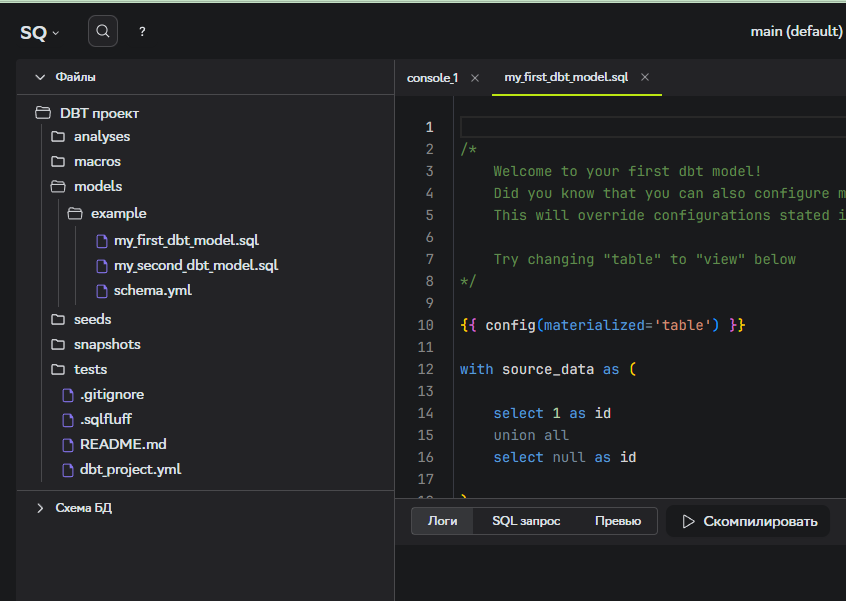
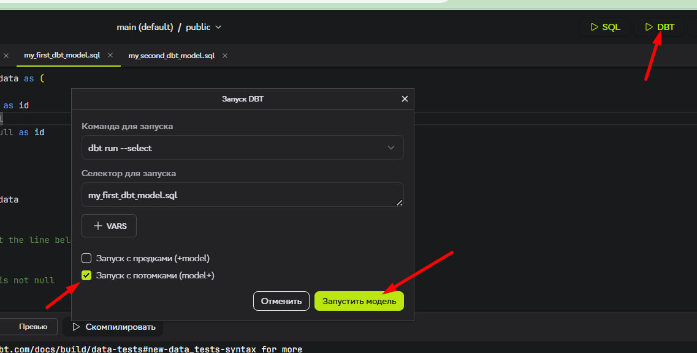
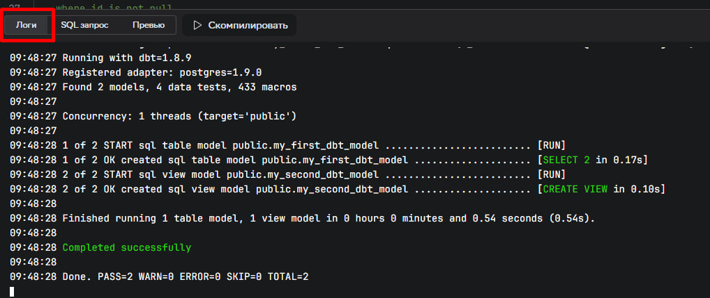

После инициализации проекта в директории **models/example** автоматически создаются модели dbt, предоставляемые по умолчанию.



---

Рассмотрим файл с названием **my_first_dbt_model.sql**

Сначала идет конфигурация модели.

```py
{{ config(materialized='table') }}
```

в ней указываются необходимые аргументы. В данном случае указан тип материализации - Таблица. Это значит что **dbt** при каждом запуске будет создавать/пересоздавать таблицу с названием как у данного файла.

Более подробно про конфигурации в **dbt** моедлях можно узнать [здесь.](https://docs.getdbt.com/reference/model-configs#general-configurations)

Далее переходим к содержимому файла - SQL запросу.

```sql
with source_data as (
  select 1 as id
  union all
  select null as id
)
select *
from source_data
```


Он будет выполнен при запуске **dbt** модели. Т.е в результате мы получим таблицу в БД с названием `my_first_dbt_model` содержащую исполненный sql запрос.

Рассмотрим следующую модель `my_second_dbt_model`. Она имеет тип материализации view так как этот тип представлен в **dbt** по умолчанию при отсутсвии настроек в конфигурации или если не указано иное значение в **dbt_project.yml.**

Внутри модели мы видим запрос с использованием Jinja и функции `ref()` которая определяет отношения между моделями.

```sql
select *
from {{ ref('my_first_dbt_model') }}
where id = 1
```

Данная функция позволяет нам запускать модели с предками
`+my_second_dbt_model` или потомками `my_first_dbt_model+` определяя очередность между запусками.

Давайте выполним запуск нашей **dbt** модели.

1. Кликаем **DBT запуск** (*иконка в правом верхем углу*) или горячие клавиши (<kbd>ctrl + shift + enter</kbd>)
2. Выбираем команду для запуска `dbt run`

3. Вводим название модели для запуска (*если осуществляем запуск, находясь в файле модели, то название подставляется автоматически.*)
4. Выбираем запуск с предками или потомками (*в нашем случае выберем с потомками*)

5. Кликаем **Запустить модель**





6. При успешной отработке запуска модели вы увидите в логах с зеленой подсветкой сообщение **Completed successfully**.


