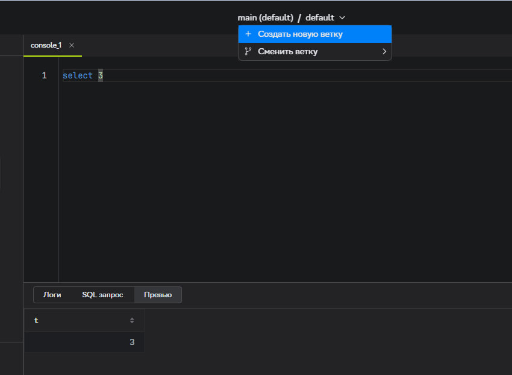
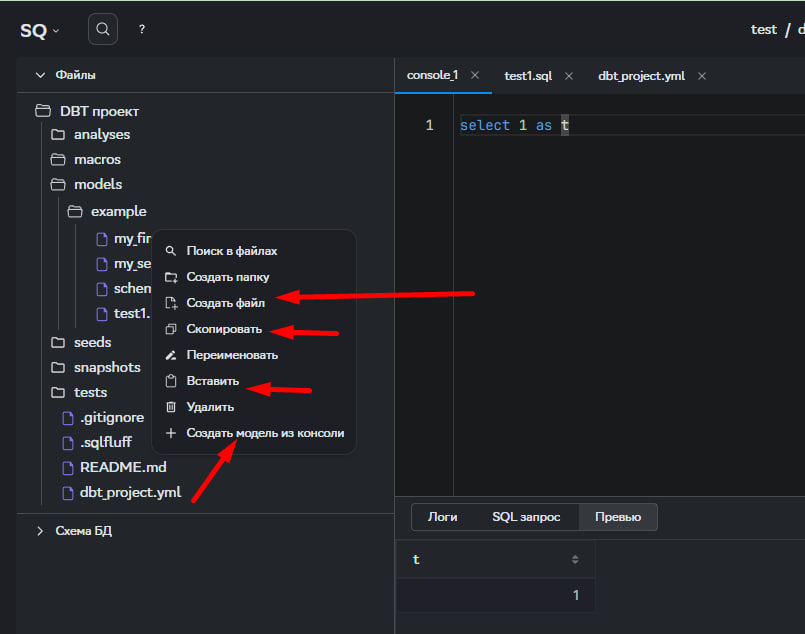

:::caution[Важно]
Создавать и редактировать модели можно только в отдельно созданной рабочей области (НЕ в _default_).
:::

### Пошаговая инструкция:
1. В верхней части интерфейса, где указано название dbt-профиля, нажмите на стрелочку вниз.
2. Выберите **"Создать новую рабочую область"**.
3. Укажите:
   - Имя рабочей области.
   - Описание рабочей области (при необходимости).
4. Если необходимо перенести все открытые вкладки из _default_ в новую рабочую область, поставьте флаг рядом с **"Перенести текущие вкладки"**.
5. Нажмите **"Создать"**.
6. После создания вы автоматически перейдете в новую рабочую область.

---

## Создание моделей в SubQuery.

Модели в SubQuery можно создать тремя способами:

### 1. Из SQL-консоли
- Откройте SQL-консоль и выполните запрос.
- Кликните правой кнопкой мыши по нужной папке, где хотите создать модель.
- Выберите **"Создать модель из консоли"**.
- Введите имя файла и нажмите **"Подтвердить"**.
- Модель будет создана с дефолтной конфигурацией и автоматически подставленным расширением файла.

### 2. Через создание нового файла
- Кликните правой кнопкой мыши по нужной папке.
- Выберите **"Создать файл"**.
- Введите имя файла и нажмите **"Подтвердить"**.

### 3. Копирование существующей модели
- Найдите уже имеющуюся модель.
- Скопируйте её и вставьте в нужную папку.
- Переименуйте скопированную модель.

