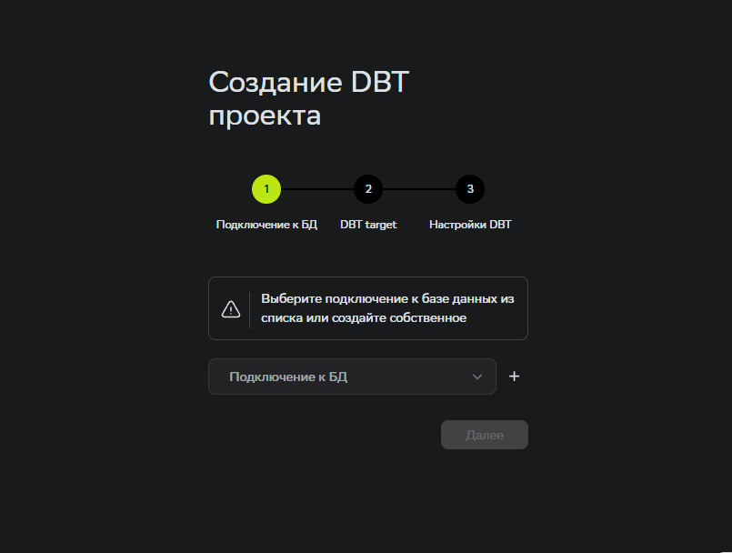
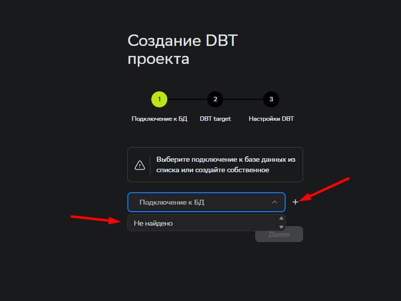
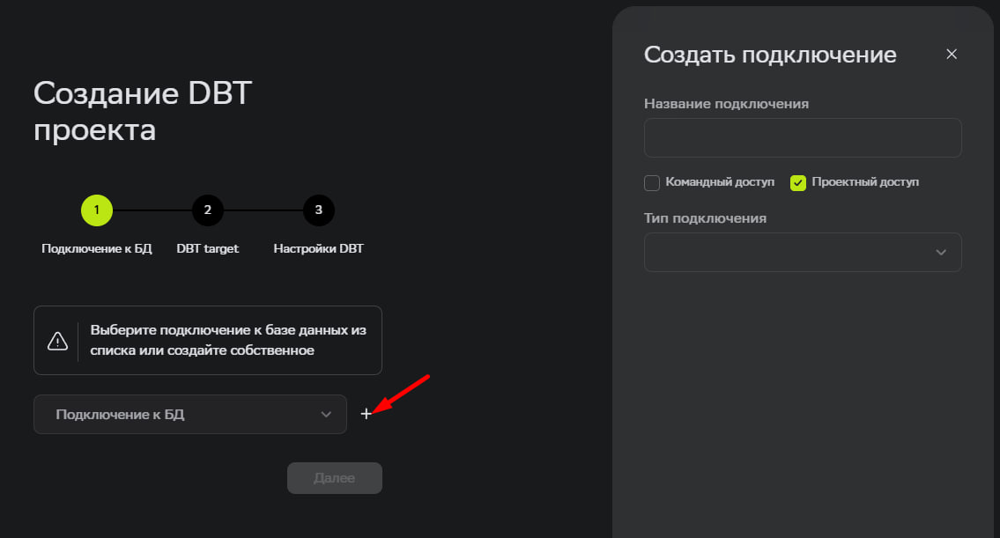
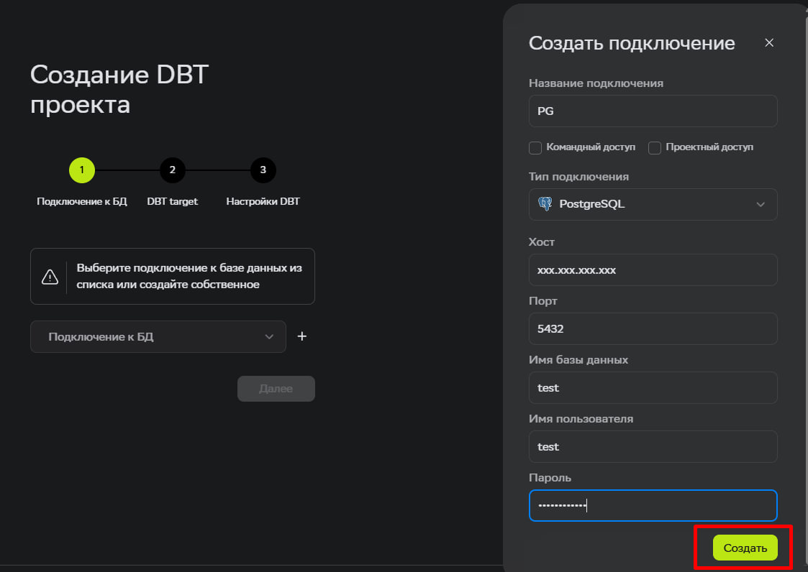
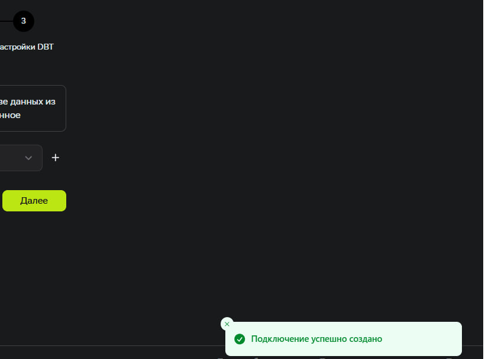
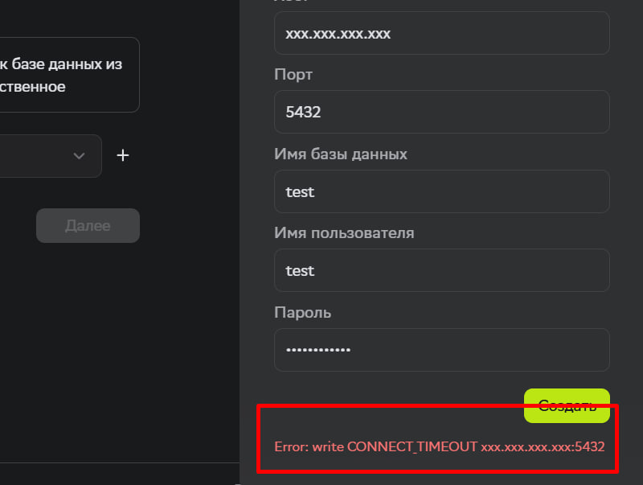
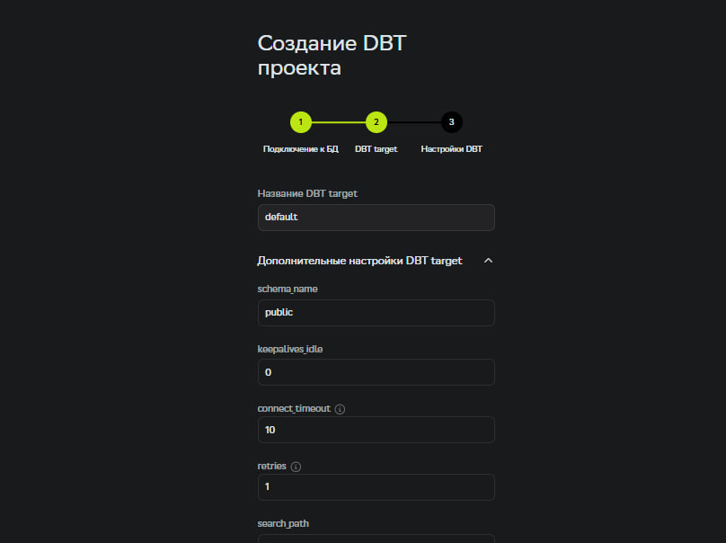
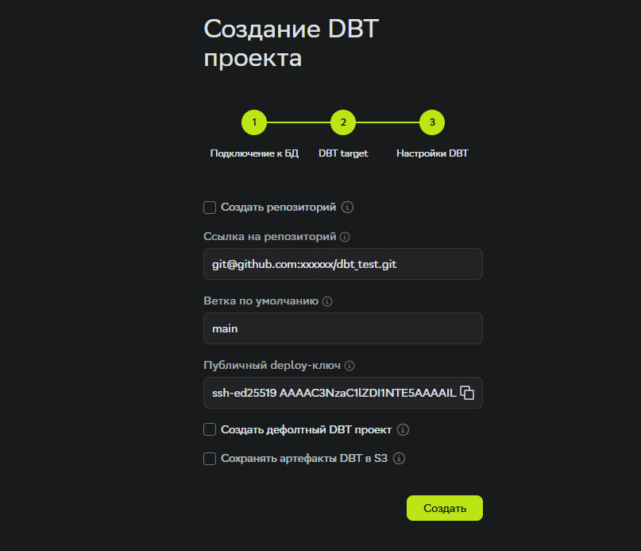
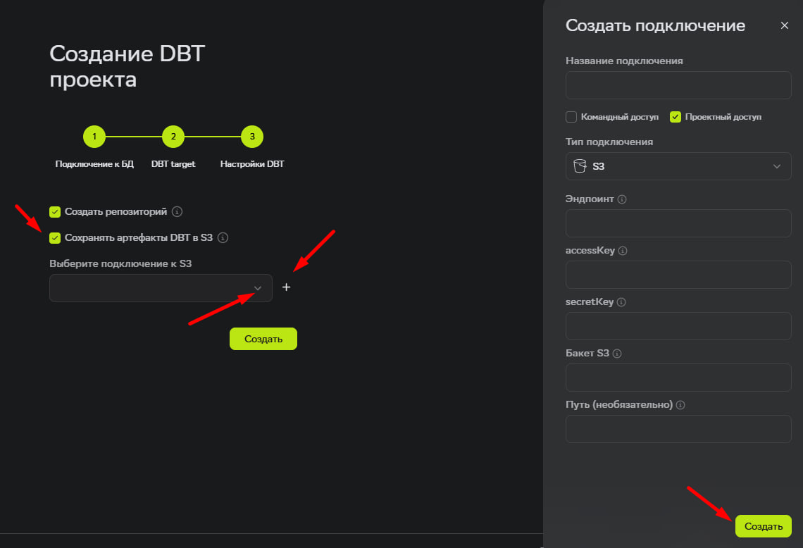

#### 1. Подключение к базе данных.

- При создании проекта dbt нам необходимо добавить подключение к базе данных. Мы добавили подсказки, чтобы было легко ориентироваться в выборе нужных действий.

- Все доступные подключения отобразяться в выпадающем списке.

- Если доступных подключений нет, то необходимо добавить новое с помощью знака плюс справа от списка.

 ###### Создание подключения:
1. Введите **Название подключения.**
2. Выберите **Тип подключения.**
3. Введите **Хост**
4. Введите **Порт**
5. Введите **Имя пользователя**
7. Введите **Пароль**

 

- Подключение **Успешно**

 
 

- Подключение завершилось  **ошибкой**. Проверьте введенные значения в полях на корректность и попробуйте снова.

---

#### 2. DBT target.
1. Введите **Название DBT target.**
2. Введите дополнительные настройки при необходимости.

Подробнее про конфигурацию профайлов для каждого адаптера, можно найти в документации:
1. [dbt-postgres](https://docs.getdbt.com/docs/core/connect-data-platform/postgres-setup#profile-configuration)

2. [dbt-clickhouse](https://github.com/ClickHouse/dbt-clickhouse)

---

#### 3. Настройки DBT.
1. Выполните одно из действий:
   - **Создать новый репозиторий** (флаг установлен по умолчанию)
   - **Подключить существующий репозиторий**
     - **Ссылка на репозиторий:** вставьте SSH-ссылку на ваш репозиторий.
     - **Ветка по умолчанию:** укажите название основной ветки..
     - **Публичный deploy-ключ:** скопируйте и добавьте  ***SSH keys***/ ***Deploy keys*** в свой репозиторий.

2. **Сохранять артефакты DBT в S3**. Флаг устанавливается в случае необходимости передачи артефактов manifest.json и catalog.json в ваш S3 для внешних подключений. При активации данной опции необохимо создать подключение к S3 или выбрать из имеющихся.

После успешной настройки dbt проекта вы попадаете в уже настроенный под вас UI для работы с **dbt** моделями.
 
